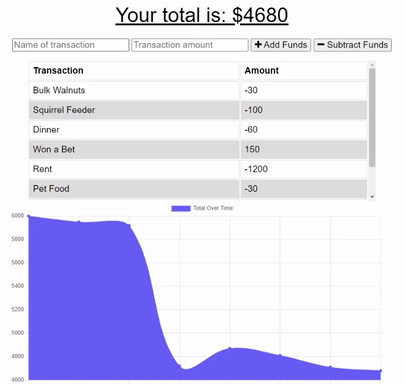

# Budget Tracker PWA

This is a budget-tracking progressive web-app that allows for recording transactions into and from a total budget. A user can name transactions, set a monetary amount, then select to either add or subtract funds with the respective buttons.

Transactions are added to a scrollable list, and this data can then be visualized via a line chart below that displays the user's total budget over time.

As a progressive web-app, this budget tracker can be installed and run in a standalone form. Additionally, any transactions generated while offline are stored locally in the browser's IndexedDB until an online connection is reestablished, and they are then uploaded to the remote database.

## Deployed Page

* [See live site here](https://agile-shore-77485.herokuapp.com/).

---

## Getting Started

These instructions will get you a copy of the project up and running on your local machine for development and testing purposes. See deployment for notes on how to deploy the project on a live system.

### Prerequisites

* IDE to view/edit source code (e.g. Visual Studio Code).
* [Node.js](https://nodejs.org/en/).
* [MongoDB](https://www.mongodb.com/).

### Installing

1. Clone repository.
1. Navigate to `budget-tracker-pwa` directory in terminal.
1. `npm install` dependencies.
1. Run with `npm start`.
1. Open `http://localhost:3000/` in web browser.

### Deployment

1. Upload to webhosting service, such as [Heroku](https://www.heroku.com/).
1. Attach MongoDB hosting service, such as [MongoDB Cloud](https://www.mongodb.com/).

---

## Built With

* [Mongoose](https://www.npmjs.com/package/mongoose)
* [MongoDB](https://www.mongodb.com/)
* [Express.js](http://expressjs.com/)
* [Node.js](https://nodejs.org/en/)

## Author

Vince Lee
- [Portfolio](https://starryblue7.github.io/portfolio-iii/)
- [Github](https://github.com/StarryBlue7)
- [LinkedIn](https://www.linkedin.com/in/vince-lee/)

## License

[MIT License](https://vince-lee.mit-license.org/)

## Acknowledgments

* Data visualization by [Chart.js](https://www.chartjs.org/).
* Database service provided by [MongoDB Cloud](https://www.mongodb.com/).
* Webhosting by [Heroku](https://www.heroku.com/).